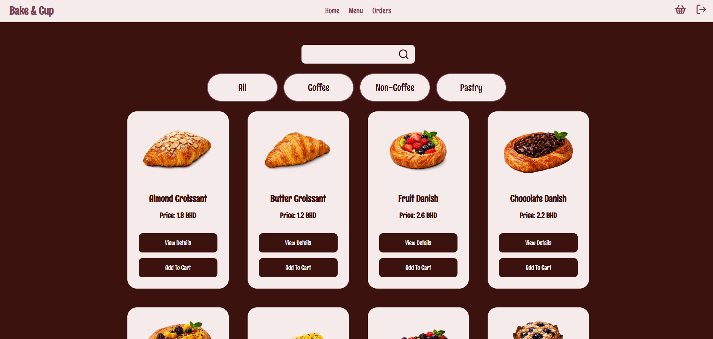

# Project Name
Bake & Cup

# Overview
An online cafe that allows users to order coffee drinks, non-coffee drinks, pastries.

## Frontend Link
https://github.com/ma-all/bake-and-cup-frontend

## Screenshot

## Technologies Used (Backend)
- **JS**
- **MongoDB**
- **Stripe**

## Getting Started
1. git clone https://github.com/ma-all/bake-and-cup-frontend.git
2. npm install

## How To Use
1. Sign up to create a new account or sign in to if you already have an account.
2. Click on Menu to view available items.
3. Click on 'view details' to view the details of an item.
4. Click on 'add to cart' to add an item to cart, and increase or decrease quantity.
5. Click on 'place order' to proceed to payment.
6. User can pay cash on delivery or by card.
7. Click on 'view order details' to view the details of order after payment.
8. Navigate to orders to view all the orders.
9. Click on 'view details' to add a review of an item.

## Features
- Add items to cart.
- Pay with cash or card.
- View order.
- Delete an order.
- Add review of an item.

## Future Enhancements
- Add more items.
- Allow new ways of payment.
- Allow users to edit their orders.
- Allow users to recommend items to other users.
